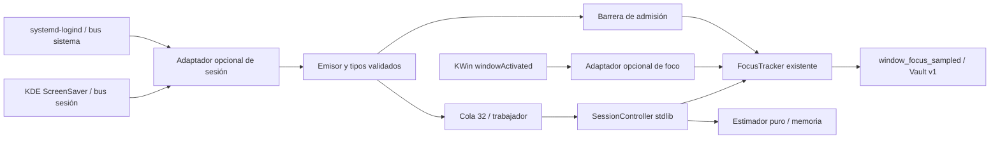

# SIEGFRIED v1.0 — GATE F5.2

Fecha: 2026-10-09. Repositorio: `/media/okami/Mio/Siegfried`.

**Veredicto: PASS_WITH_DEVIATIONS.** Implementación incremental y verificaciones permitidas completas. Suspensión, bloqueo y apagado/reinicio físicos pendientes; no se provocaron. F5.3 no implementado.

## 1. Resumen ejecutivo

Se añadió un adaptador opcional de sesión logind/KDE, un coordinador determinista que reutiliza el único `FocusTracker` y un estimador puro de ausencia. Las transiciones cierran la actividad al suspender/bloquear y esperan nuevo foco al reanudar/desbloquear. La ausencia de fuentes, desconexión, saturación o pérdida de continuidad impide atribuir actividad incierta, sin detener Pomodoro, postura, CLI, Vault ni alertas.

La excepción de bindings nativos quedó **autorizada explícitamente por la instrucción del Gate F5.2**, y formalizada en `SPECIFICATION.md`. No se clasifican como stdlib ni se convierten en requisitos del núcleo. Ambos adaptadores permanecen desactivados por defecto.

Resultado final: **64 pruebas F5.2 y 544 pruebas de regresión PASS**, cinco SLO del harness PASS, transporte nativo aislado PASS, tres ciclos de lectura/suscripción/cancelación en el host PASS y `git diff --check` PASS. Los contratos congelados se conservaron. No hubo instalaciones, commits, push, activación persistente, suspensión ni bloqueo del host.

## 2. Estado inicial Git

HEAD inicial y final: `cba9059`. El árbol **ya tenía cambios**: 10 archivos rastreados modificados y 14 sin seguimiento. `git diff --stat`: 705 inserciones y 92 eliminaciones; `git diff --check`: exit 0. No se restauró, destruyó ni sobrescribió trabajo previo.

Últimos cinco commits inspeccionados:

```text
cba9059 feat: Add comprehensive integration tests for Gate F3.1 and user service installer
b4ac8ed feat: Add integration tests for IPC backpressure and enhance cloud inference security
6d03d70 feat: Add comprehensive unit tests for persistence, secrets loading, state machine, storage, and validation
48f0253 Refactor(documentation for Siegfried): Update architecture specification and design philosophy...
17ebfe3 chore: Add initial implementation plan and specifications for Siegfried MVP
```

Se leyeron PLAN, SPECIFICATION, README, reporte F5.1.1, tracker, daemon, agregador, contratos, boot hook y pruebas F5.1/F5.1.1. No se encontraron instrucciones `AGENTS.md` aplicables. Baseline conservado: **480 pruebas**; F5.2 agrega 64.

## 3. Decisiones arquitectónicas, causas y correcciones

| Hallazgo / necesidad | Implementación mínima |
|---|---|
| F5.1 exponía hooks de suspensión sin conectar señales del sistema | Adaptador logind/KDE opcional y `SessionController`; el tracker existente conserva la propiedad del intervalo. |
| Restricción stdlib frente a bindings externos | Excepción autorizada para adaptadores, imports diferidos y degradación; nada de pip, servicios nuevos ni dependencias KDE en dominio. |
| Actividad anterior podía sobrevivir a bloqueo/suspensión | Barrera rápida de admisión, cierre al tiempo de llegada, generaciones y rechazo de foco encolado obsoleto. |
| Deduplicación JavaScript podía ocultar la recuperación de la misma app | El watcher entrega cada activación nativa; Python deduplica dentro de la generación vigente. Ambas copias JS permanecen iguales. |
| Dos loops GLib por daemon | El adaptador de sesión posee el loop y foco lo comparte; foco puede operar solo cuando sesión está desactivada. |
| Disco lento o fallo de append podía bloquear/escapar del cierre | Callbacks sólo validan/encolan; worker separado. Cierre acotado informa hilos residuales y errores terminales sin texto privado. Repetir `daemon.stop()` conserva un resultado de limpieza fallida, sin afirmar éxito. |
| Carrera `quit()` antes de `MainLoop.run()` observada en ensayo nativo | Handshake de disponibilidad mediante `GLib.idle_add`, con espera limitada al inicio. Tres ciclos finales liberaron todos los hilos. |
| libdbus podía reutilizar la dirección de SessionBus cacheada al cambiar entorno en el ensayo | `BusConnection(address, mainloop=...)` explícita sobre dirección Unix validada; el bus aislado no hereda la conexión del host. |
| Estimación basada en monotónico ordinario o dos timestamps sin evidencia | `CLOCK_BOOTTIME` y continuidad del arranque; timestamps de pared independientes sólo cuando hay validación explícita. |
| Catálogo circadiano no representa suspensión/bloqueo | No se inventan eventos; estimación interna volátil, brecha contractual documentada. |

El núcleo valida y calcula; no se consulta al LLM para decidir estados, duración o estimaciones. No se añadieron abstracciones de foco, temporizadores o persistencia duplicadas.

## 4. Diagrama de integración



Un loop GLib compartido recibe entradas; trabajadores distintos procesan sesión/foco fuera del callback. La máquina de salud, reactor IPC, Pomodoro e inferencia conservan sus mecanismos existentes.

## 5. Dependencias nativas opcionales

| Dependencia existente | Versión observada | Uso |
|---|---|---|
| Python | 3.14.4 | Núcleo, CLI y pruebas |
| `python3-dbus` | 1.4.0-1build2 | D-Bus, credenciales del broker, suscripciones; servicio de foco |
| `python3-gi` | 3.56.2-1 | PyGObject / `gi.repository.GLib` |
| `libglib2.0-0t64` | 2.88.0-1ubuntu0.1 | Loop nativo GLib |
| systemd | 259.5-0ubuntu3.4 | logind existente; no se crea un servicio privilegiado |

`dbus`, `dbus.service`, `dbus.mainloop.glib` y `gi.repository` **no son Python Standard Library**. `dbus.service` sigue encapsulado en foco; sesión no exporta objetos ni reserva nombres. Imports nativos sólo en `start()`, después del opt-in: `SIEGFRIED_ENABLE_SESSION=1` y/o `SIEGFRIED_ENABLE_KWIN=1`. GLib/GIR pueden tener nombres de paquete distintos en otra distribución.

Falta de bindings o bus: retorno controlado, núcleo operativo. Si el usuario habilitó sesión pero faltan fuentes, el foco queda cerrado por observabilidad incompleta. Desactivar sesión conserva la operación F5.1. Pruebas con `python3 -S` pasan sin site-packages; la ausencia de `dbus` y `gi` se comprueba separadamente en fixtures. No se instaló ningún paquete ni se activó el adaptador persistentemente en el host.

## 6. Señales logind y KDE utilizadas

Se contrastaron documentación primaria e introspección del entorno, sin invocar métodos de suspensión, bloqueo o apagado.

| Origen | Interfaz / señal o lectura | Significado |
|---|---|---|
| Bus sistema | `org.freedesktop.login1.Manager.PrepareForSleep(b)` | `true`: comienza preparación; `false`: retorno. No demuestra por sí sola sueño humano. |
| Bus sistema | `PrepareForShutdown(b)` | Apagado iniciado/cancelado, distinto de suspensión. |
| Bus sistema | `SessionRemoved(s,o)` | Pérdida de la sesión validada; otras sesiones se ignoran. |
| Sesión logind | `PropertiesChanged`, `Active`, `LockedHint`, `State` | Inactividad, pista de bloqueo, cierre; invalidación relevante degrada observabilidad. |
| KDE, bus sesión | `org.freedesktop.ScreenSaver` `/ScreenSaver`, `ActiveChanged(b)` | Bloqueo/desbloqueo; `GetActive()` sólo durante bootstrap. |
| Broker | `NameOwnerChanged` | Pérdida/cambio de emisor; se fija identidad de nuevo únicamente al reiniciar. |

`PreparingForSleep`/`PreparingForShutdown` se leen sólo como snapshot inicial: no crean un inicio de ausencia retrospectivo. `AboutToLock` de KDE está disponible pero **no se usa**: expresa intención, no bloqueo completado.

Resolución: `GetSessionByPID`, con fallback a `XDG_SESSION_ID` validado, seguido de comprobaciones de UID, tipo gráfico (`wayland`/`x11`) y clase de usuario. En este entorno el proceso no se resolvió por PID; fallback a sesión 3 verificado, ruta `/org/freedesktop/login1/session/_33`, UID 1000, tipo Wayland. logind tenía propietario `:1.8`, UID 0; ScreenSaver `:1.16`, UID local. Estos nombres son evidencia de la ejecución, no valores hardcodeados.

La semántica de logind procede de su [documentación oficial en systemd](https://raw.githubusercontent.com/systemd/systemd/main/man/org.freedesktop.login1.xml). El contrato ScreenSaver se contrastó con el [XML oficial de KDE](https://raw.githubusercontent.com/KDE/kscreenlocker/master/dbus/org.freedesktop.ScreenSaver.xml). dbus-python integra GLib sobre el contexto por defecto; se comparte el loop en el daemon según esa limitación. [Documentación oficial](https://dbus.freedesktop.org/doc/dbus-python/dbus.mainloop.html).

## 7. Máquina de estados de sesión

Estado interno, sin cambios de Config Schema/IPC:

| Estado | Entrada / comportamiento |
|---|---|
| `UNKNOWN` | Inicio o snapshot incompleto; admisión cerrada. Ausencia de señales no significa actividad. |
| `ACTIVE` | Cinco indicadores conocidos y compatibles: no suspendido/apagando/bloqueado, sesión activa. Permite nuevo foco. |
| `LOCKED` | KDE bloqueado o LockedHint; ambos deben despejarse para volver a admitir foco. |
| `INACTIVE` | Sesión no activa; no se interpreta como descanso. |
| `SUSPENDED` | Inicio de suspensión observado; cierre del intervalo y posible par temporal. |
| `SHUTTING_DOWN` | Apagado, prioridad distinta de suspensión; sin par inventado después de reiniciar. |
| `SESSION_LOST` | Sesión retirada/cerrada; terminal hasta nuevo bootstrap. |
| `DEGRADED` | Desconexión, pérdida de propietario, saturación, error de almacenamiento o desorden de reloj. Continuidad invalidada. |
| `STOPPED` | Cierre explícito; idempotente. |

Duplicados no vuelven a cerrar ni estimar. Un `resume` sin inicio observado es `INSUFFICIENT_DATA`. Snapshot durante suspensión no permite estimar el tiempo previo. Desconexión borra el par; eventos posteriores no reparan retrospectivamente la evidencia. Recuperación requiere parada/inicio explícitos del adaptador, sin polling ni reconexión automática oculta.

## 8. Coordinación con FocusTracker y concurrencia

Al suspender, bloquear o inactivar, el callback cierra la **admisión** con un lock corto sin esperar el lock de disco. El worker cierra el intervalo al monotónico capturado a la llegada. Reanudación/desbloqueo abre admisión sólo al reconciliar todas las fuentes; no inicia una app anterior. Se exige una nueva activación válida.

Generaciones y tickets rechazan foco encolado anterior y evitan que un desbloqueo antiguo revierta un bloqueo posterior pendiente. Duplicados consecutivos en cola conservan el **primer** instante del límite. La preferencia manual de habilitar/deshabilitar foco no es reemplazada por sesión.

Orden de locks: coordinador → tracker → barrera corta; el callback no adquiere el lock del coordinador ni del tracker. El worker abandona el lock de cola antes de llamar al coordinador y escribir Vault. El reactor principal no procesa esos callbacks ni fsync. No se añadieron llamadas reentrantes con Lock ordinario; el RLock existente del tracker se conserva.

La parada cancela señales/conexiones, drena con tiempo acotado y retorna fallo si sobrevive un worker. No mata threads bloqueados en disco ni procesos ajenos. Con sesión activa, ese worker posee el cierre terminal del foco: daemon no espera otra vez su lock. El ensayo con append deliberadamente bloqueado retorna fallo antes de 0.3 s para timeout 0.08 s; luego libera el fixture y el hilo termina. Una segunda parada no transforma ese fallo en éxito.

## 9. Cálculo determinista de descanso

`src/siegfried/core/rest.py` es stdlib y puro. Fórmula sólo para ausencia corroborada de **≥90 minutos**:

```text
ventana estimada (minutos) = tiempo transcurrido (segundos) / 60 − 25
8 horas → 480 − 25 = 455 minutos = 7 h 35 min
90 minutos → 65 minutos
menos de 90 minutos → NOT_APPLICABLE, sin ventana calculada
```

Cuatro estados: `ESTIMATED`, `INSUFFICIENT_DATA`, `NOT_APPLICABLE`, `INVALID_INTERVAL`. Bloqueo/inactividad no cuentan como causa de descanso. Valores booleanos, no finitos, números extremos no representables, evidencia mal tipada o cronología contradictoria se rechazan deterministamente. Motivos son constantes, sin payload privado.

Linux `CLOCK_MONOTONIC` mide tiempo activo y **excluye suspensión**; `CLOCK_BOOTTIME` incluye el tiempo suspendido. Ambos pertenecen al arranque y no se comparan entre boots. Se exige identidad del boot para usar BOOTTIME; reloj de pared se valida y un desacuerdo mayor de 5 s frente a BOOTTIME invalida el intervalo. Cambios de reloj legítimos pueden producir un falso negativo conservador. [Linux man-pages: clock_gettime](https://man7.org/linux/man-pages/man2/clock_gettime.2.html).

Entre boots o sin BOOTTIME, el cálculo sólo admite timestamps de pared con una validación independiente explícita; encontrar dos registros no la proporciona. El daemon no tiene esa evidencia histórica y retorna datos insuficientes. `boot_hook.py` delega al cálculo puro y requiere `interval_verified=True` explícito para un par de pared; por defecto no estima. El helper interno devuelve `RestEstimate`, no un número presentado como sueño confirmado. No hay llamadores numéricos existentes en el repositorio que dependan del retorno anterior.

Texto permitido implementado: «Se detectó una ausencia prolongada del equipo. La ventana de descanso estimada es de 7 h 35 min». No afirma cuánto durmió la persona ni infiere calidad, REM, diagnósticos o biometría.

## 10. Persistencia y compatibilidad de contratos

`sleep_initiated` mantiene el significado existente de retiro explícito y datos de su catálogo; `wake_detected` no se redefine como reanudación de logind. Un bloqueo o suspensión no es ese evento circadiano. No existe un evento v1 adecuado para persistir la nueva evidencia de sesión/estimación.

**Brecha formal:** F5.2 calcula y expone internamente la estimación, sin persistencia nueva ni reconstrucción histórica entre reinicios. Se conserva en memoria; un restart pierde el par y retorna `INSUFFICIENT_DATA`. Cumple la alternativa autorizada en E3 y evita duplicados o extensiones encubiertas. Incorporar almacenamiento de esos pares requerirá una autorización contractual posterior.

Sólo se persiste el `window_focus_sampled` existente, con `aplicacion`, `categoria`, `duracion`. `git diff -- schemas src/siegfried/contracts` vacío. Event Schema v1, IPC Protocol v1 y Config Schema v1 intactos. No se agregó configuración de dominio KDE ni una ruta IPC de estimación. La salud circadiana/Pomodoro no cambia de estado a partir de estas señales.

## 11. Seguridad, privacidad y límites del bus

| Superficie | Control | Límite residual |
|---|---|---|
| Identidad | Nombre único consultado al broker; logind UID 0; KDE UID local; sesión gráfica validada; propietario vigilado y revalidado al arrancar | El mismo UID puede controlar scripts/servicios KDE o apropiarse del nombre ausente. Pinning no certifica binario ni script particular. |
| Permisos | Buses existentes sin cambio de políticas; sólo transporte Unix; conexiones privadas | No se declara que pertenecer al bus autentique KWin. Un endpoint Unix elegido mal por el usuario sigue siendo su frontera de confianza. |
| Mensajes | Booleano real para señales; variantes de señal rechazadas; sólo propiedades conocidas, dict/list de hasta 32; focus ASCII ≤64; sesión exacta | La deserialización nativa sucede antes de la validación Python. No es un límite del mensaje D-Bus completo. |
| Saturación | Cola sesión 32, tasa 20/s, ráfaga 40; foco conserva cola 64; duplicados coalescidos | Overflow degrada y pierde telemetría; no certifica protección contra OOM nativo ni inundación sostenida del broker. |
| Desconexión | Cierra admisión, invalida evidencia, elimina identidad; callback de conexión antigua no afecta restart | Recuperación explícita; ninguna actividad se deduce de señales ausentes. |
| Disco / shutdown | Worker separado, colas acotadas, join limitado y fallo honesto ante residuo | Python no cancela un fsync bloqueado; consultas internas al tracker/coordinador pueden esperar su lock. |
| Privacidad | Sin títulos, URLs, rutas, teclas, terminal ni biometría; estimación y boot ID sólo memoria; no Cloud/LLM | IDs de apps originados por otro cliente no prueban universalmente ausencia de secretos. |

Session adapter no ejecuta comandos ni crea subprocesses/nombres/servicios; sólo lecturas y matches. La herramienta E2E crea exclusivamente un `dbus-daemon` hijo aislado y termina ese PID concreto, también si falla la limpieza de un adaptador. Vault temporal inspeccionado con **0600**. Excepciones de persistencia, incluido el cierre terminal, no se vuelcan con payload sensible y el cierre informa fallo. La prueba intercepta `urllib.request.urlopen` y creación de procesos: cero llamadas durante transiciones; la ruta de sesión no importa ni invoca el motor de inferencia.

El límite del broker no se modificó ni se probó mediante saturación del bus del host. La especificación admite mensajes mayores que los payloads aceptados por Siegfried; las cuotas existentes y bindings siguen siendo parte de la superficie. [Especificación D-Bus](https://dbus.freedesktop.org/doc/dbus-specification.html).

## 12. Pruebas unitarias e integración F5.2

Archivo nuevo: `tests/integration/test_session_rest_f52.py`, **64 casos**:

| Grupo | Casos | Cobertura |
|---|---:|---|
| A — Señales | 10 | Suspend/resume, duplicados, orden incorrecto, snapshot desconocido, desconexión, inactividad, apagado, pérdida de sesión, boot distinto. |
| B — FocusTracker | 12 | Cierre al suspender/bloquear, misma app al recuperar, preferencia manual, epochs/tickets, nuevos focos, restart y concurrencia adversarial sin deadlock. |
| C — Descanso | 15 | 8 h, <90, =90, monotónico insuficiente, clocks inválidos/cambiados, par faltante, reinicio, pared verificada y boot hook sin efectos. |
| D — Seguridad | 8 | Emisor ajeno, tipos malformados, límites de propiedades, sesión removida ajena, catálogo preservado, datos/permisos y cero Cloud. |
| E — Resiliencia | 11 | Sin bindings, sin fuentes, reinicio/desconexión tardía, backpressure/memoria, disco lento/error, cancelación/cierre, timers/postura intactos. |
| F — Fronteras API nativa simulada | 8 | Ambos orígenes/uno/ninguno, direcciones remotas rechazadas, cierre inicial de sesión, overflow numérico y banderas inválidas. |

Relojes simulados y Vault/HOME temporales; sin suspensión física. Saturación: **10,000 entradas**, cola ≤32, crecimiento trazado retenido <200 KB y pico <1 MB en el fixture. Esto comprueba acotación Python para ese workload, no RSS sostenido ni memoria de deserialización nativa.

Comando específico final:

```bash
PYTHONPATH=src timeout -s INT -k 5s 60s python3 -X faulthandler -m unittest tests.integration.test_session_rest_f52 -v
```

**64 tests, 0.143 s, OK**, exit 0. Repetición con `python3 -S -X faulthandler`: **64 tests, 0.159 s, OK**. Las 42 pruebas F5.1/F5.1.1 también pasaron durante la implementación y están incluidas en la regresión completa.

## 13. Verificación real frente a simulada

Comando final, exit 0:

```bash
PYTHONPATH=src timeout -s INT -k 5s 60s python3 -X faulthandler tools/verify_session_f52.py
```

| Ensayo | Evidencia final | Alcance |
|---|---|---|
| Host, lecturas y suscripciones reales | 3 ciclos; logind/KDE disponibles; 7 matches cada ciclo; ACTIVE, observabilidad no degradada, descanso INSUFFICIENT_DATA | Interfaces, acceso, bootstrap, suscripción/cancelación reales. |
| Host, limpieza | Conexiones desconectadas, matches retirados e hilos terminados en todos los ciclos | No se reservan nombres por sesión; no se carga watcher ni abre ventanas del host. |
| Bus aislado con bindings reales | Señales sintéticas `ActiveChanged`/`PrepareForSleep`; foco a través de FocusDBusAdapter real y loop compartido | Transporte/decodificación reales, semántica de transiciones simulada. |
| Bloqueo sintético | Duplicado idempotente; recuperación de misma app y nuevo foco | No valida bloqueo físico del locker KDE. |
| Suspensión de 8 h simuladas | Estimación 455.00016982071674 min; sólo reloj de fixture avanzado | No se cambia reloj del host ni se suspende hardware. Diferencia fraccional proviene del tiempo de ejecución. |
| Foco y privacidad | 3 eventos, duraciones **0.04 / 0.04 / 0.03 s**, todos <1 s; campos v1 y modo 0600 | Sin intervalo falso de 8 h; no demuestra timing de callbacks durante suspensión física. |
| Seguridad aislada | Otro emisor rechazado; booleano variante/string mal tipados ignorados; foco de conexión ajena devuelve false | El dueño del bus aislado es una fixture del mismo UID; no sustituye la validación UID 0 de logind en host. |
| Proceso de ensayo | `owned_bus_process_terminated=true` | Sólo proceso hijo creado, sin matar KWin/logind/bus del host. |
| Suspensión, bloqueo, apagado/reboot físicos | **PENDIENTE** | Omitidos por restricciones expresas; no equivalen a las simulaciones. |

No se modificaron autostart, unidades systemd, KPackage instalado, políticas del bus, HOME real ni configuración persistente. No se invocaron `systemctl suspend`, `loginctl lock-session`, `systemctl poweroff` ni reboot. El ensayo real F5.1.1 de dos aplicaciones se conserva como evidencia histórica; no se repitió control de ventanas del host para F5.2.

## 14. Regresión completa

Ejecutada después de la última corrección de cierre, antes del benchmark, sin concurrencia entre ambos:

```bash
PYTHONPATH=src timeout -s INT -k 5s 180s python3 -X faulthandler -m unittest discover -s tests -p "test_*.py"
```

**544 tests, 34.812 s, OK**, exit 0; 0 fallos, 0 errores de unittest, 0 omitidos. La suite incluye fixtures HTTP locales; no se habilitaron conexiones públicas. Los mensajes de fallos inyectados, `ResourceWarning` de sockets/HTTP y un `BrokenPipeError` del servidor HTTP de pruebas aparecieron en stderr, sin fallo de assertions. No se afirma una ejecución libre de warnings ni se modifican componentes ajenos para ocultarlos.

Checks adicionales: `git diff --check` exit 0; copias JS idénticas (`cmp`); sintaxis JS `node --check` exit 0; contratos/esquemas sin diff. Se revisaron los 20 archivos sin seguimiento y no quedaron artefactos de benchmarks o ensayo nativo. Los seis archivos nuevos F5.2 no tienen whitespace final. La comprobación independiente detectó whitespace heredado en `GATE_F4_1_REPORT.md`, `GATE_F5_1_REPORT.md` y `storage/aggregator.py`, que se preservó sin editar; `git diff --check` no incluye archivos sin seguimiento.

## 15. Benchmarks, exactitud histórica y SLOs

Comando final: `PYTHONPATH=src python3 tools/benchmark.py`, exit 0. Medición secuencial tras la regresión; append con fcntl/fsync en el **ext4 persistente del repositorio**, datos temporales eliminados al acabar.

| Medición | Muestras | Media ms | P50 ms | P95 ms | Máximo ms | Umbral / resultado |
|---|---:|---:|---:|---:|---:|---|
| Fast-Path | 2500 | 0.0011 | 0.0009 | **0.0016** | 0.0154 | <10, PASS |
| Vault append | 200 | 1.3276 | 1.1679 | **1.6960** | 20.5197 | <10, PASS P95; máximo no acotado a 10 |
| CLI cold-start (`--help`) | 50 | 26.39 | 25.93 | **33.09** | 36.88 | <50, PASS |
| Orchestrator routing | 1000 | 0.0095 | 0.0099 | **0.0123** | 0.0953 | <1, PASS |
| Histórico heurístico | 100 | 1.9338 | 1.9261 | **1.9635** | 2.3442 | <10, PASS |
| Histórico exhaustivo | 25 | 8.1697 | 8.1661 | **8.2328** | 8.2839 | Observación separada, sin garantía universal |

Cinco SLO del harness PASS. El P95 exhaustivo anterior de **8.1923 ms** fue una observación de F5.1; F5.1.1 reportó 8.2012 ms y esta ejecución reporta **8.2328 ms**. No son constantes ni límites de producción. Dataset ordenado de 20,000 eventos separados 120 s (~27.8 días), consulta de últimas 24 h (~720 eventos), caché caliente, escaneo **y formato**. No extrapola a caché fría, bitácoras grandes o saturación nativa.

Consultas IPC históricas diarias/semanales conservan `allow_early_exit=False`, con regresión específica. API genérica conserva modo heurístico por defecto; no se presenta ese corte como exacto ante desorden arbitrario. Exhaustivo evita el corte prematuro; no certifica integridad del log, relojes, eventos corruptos ni interpretación del LLM. No se modificó el agregador para este Gate.

Acotación de memoria y aislamiento de callbacks probados con workloads adversariales Python y disco bloqueado. No se midieron RSS/CPU prolongados del daemon real ni VRAM de inferencia; no se atribuye al benchmark el cumplimiento de esos objetivos de SPECIFICATION ni latencia universal frente a flood D-Bus.

## 16. Riesgos residuales y desviaciones

1. **Operativos pendientes:** suspensión/reanudación, bloqueo/desbloqueo y apagado/reinicio físicos; verificar pérdida de señales y latencia real antes de certificación física total.
2. **Persistencia ausente por contrato:** estimación interna volátil, sin reconstrucción entre daemon restart/reboot. Autorizado como alternativa en E3; ampliar catálogo exige revisión posterior, no F5.3 implícito.
3. **Entrega de señales:** no se crea sleep inhibitor ni se altera logind. Puede suspenderse antes de que Python procese una señal; tiempos de llegada y cierre requieren evidencia física. Una suspensión sin onset observado no permite estimación; si ambas señales se pierden no existe garantía de detección.
4. **Confianza local:** propietario/UID no autentican script/binario frente a un usuario con autoridad sobre la sesión. No se modifican políticas del broker.
5. **Saturación/almacenamiento:** el frontend nativo aún deserializa antes de límites Python. Disco bloqueado puede dejar un worker residual informado como fallo; no se mata el hilo. Degradación puede omitir actividad, priorizando ausencia de intervalos inventados.
6. **Recuperación:** restart explícito, sin reconexión automática. Tras desbloquear se espera nueva activación; si el compositor no la emite, no se registra foco hasta el próximo cambio/recarga.
7. **Relojes:** discrepancia de pared >5 s produce INVALID_INTERVAL incluso si BOOTTIME es consistente; no se presume sincronización fiable entre arranques.
8. **Alcance del entorno:** Python/Plasma/systemd y paquetes observados; no certificación de todas las distribuciones ni ejecución sin warnings de fixtures heredadas.

## 17. Archivos modificados y estado Git final

Archivos de F5.2:

| Archivo | Cambio |
|---|---|
| `src/siegfried/core/rest.py` (nuevo) | Tipos y cálculo puro validado. |
| `src/siegfried/daemon/session.py` (nuevo) | Coordinación de sesión sin persistencia incompatible. |
| `src/siegfried/integrations/session.py` (nuevo) | Adaptador opcional, identidad, colas y recursos. |
| `src/siegfried/daemon/focus.py` (ya sin seguimiento) | Barrera, generaciones, loop compartido, conexión explícita y cierre. |
| `src/siegfried/daemon/app.py` | Inicio/cierre coordinados; reporte honesto de limpieza. |
| `scripts/kwin_focus_watcher.js` y `scripts/kwin_focus_watcher/contents/code/main.js` | Activación entregada para recuperación; deduplicación Python. |
| `scripts/boot_hook.py` | Delegación pura con evidencia explícita, imports de efectos diferidos. |
| `tests/integration/test_session_rest_f52.py` (nuevo) | 64 pruebas. |
| `tools/verify_session_f52.py` (nuevo) | Lectura host y bus sintético aislado. |
| `PLAN.md`, `README.md`, `SPECIFICATION.md` | Excepción aprobada, implementación, evidencia y límites. |
| `docs/gates/GATE_F5_2_REPORT.md` (nuevo) | Este reporte. |

Estado final: **12 archivos rastreados modificados, 20 sin seguimiento**. Diff rastreado acumulado: 784 inserciones y 103 eliminaciones en 12 archivos; incluye trabajo previo y omite los archivos nuevos. Las modificaciones previas de CLI, exports y benchmark se preservaron; no se atribuyen a F5.2. Los sin seguimiento fueron revisados: 14 preexistentes (cinco reportes F4/F5, paquete KWin, foco/agregador, cuatro suites previas y verificador F5.1.1) más seis archivos nuevos F5.2. La copia empaquetada del watcher y el tracker ya eran sin seguimiento y recibieron cambios F5.2. No hay archivos inesperados, staging ni commits.

Salida final revisada de `git status --short --untracked-files=all`:

```text
 M PLAN.md
 M README.md
 M SPECIFICATION.md
 M scripts/boot_hook.py
 M scripts/kwin_focus_watcher.js
 M src/siegfried/cli/app.py
 M src/siegfried/cli/repl.py
 M src/siegfried/cli/router.py
 M src/siegfried/daemon/__init__.py
 M src/siegfried/daemon/app.py
 M src/siegfried/storage/__init__.py
 M tools/benchmark.py
?? docs/gates/GATE_F4_1_REPORT.md
?? docs/gates/GATE_F4_2_HARDENING_REPORT.md
?? docs/gates/GATE_F4_2_REPORT.md
?? docs/gates/GATE_F5_1_1_REPORT.md
?? docs/gates/GATE_F5_1_REPORT.md
?? docs/gates/GATE_F5_2_REPORT.md
?? scripts/kwin_focus_watcher/contents/code/main.js
?? scripts/kwin_focus_watcher/metadata.json
?? src/siegfried/core/rest.py
?? src/siegfried/daemon/focus.py
?? src/siegfried/daemon/session.py
?? src/siegfried/integrations/session.py
?? src/siegfried/storage/aggregator.py
?? tests/integration/test_historical_inference_f42.py
?? tests/integration/test_kwin_focus_f51.py
?? tests/integration/test_kwin_focus_f511.py
?? tests/integration/test_repl_interactive_f41.py
?? tests/integration/test_session_rest_f52.py
?? tools/verify_kwin_f511.py
?? tools/verify_session_f52.py
```

## 18. Veredicto final

**PASS_WITH_DEVIATIONS.** Adaptadores opcionales desacoplados, foco coordinado, estimador determinista, contratos preservados, regresión y SLO del harness aprobados. Interfaces y recursos del host se verificaron realmente; las transiciones físicas siguen pendientes y el par de ausencia se mantiene sólo en memoria por la brecha contractual autorizada. No se declara PASS físico a partir de mocks o del bus sintético. F5.3 no implementado; no se hicieron commits ni instalaciones.
