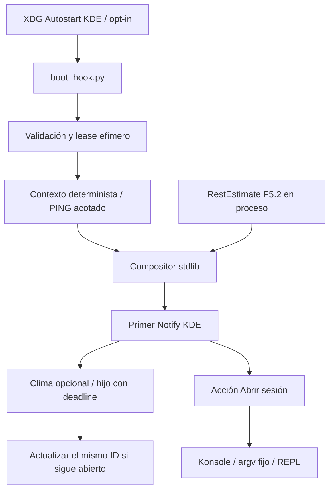

# SIEGFRIED v1.0 — GATE F5.3

Fecha: 2026-10-09. Repositorio: `/media/okami/Mio/Siegfried`.

**DICTAMEN: PASS_WITH_DEVIATIONS.** Implementación y verificaciones permitidas completas. Aparición visual del popup y tiempo desde login pendientes; Plasma anuncia notificaciones inhibidas y ese ajuste se preservó. Autostart preparado/probado en HOME temporal, sin activación real.

## 1. Resumen ejecutivo

Boot Briefing determinista, independiente del LLM y desacoplado en compositor, contexto, clima, presentación y lanzamiento. Saluda según horario, consulta disponibilidad sin espera indefinida y sólo muestra información privada con autorización/estado de pantalla suficientes. Reutiliza el estimador F5.2; no inventa descanso después de reiniciar ni añade persistencia o contratos nuevos.

La notificación nativa ofrece «Abrir sesión» sólo cuando KDE anuncia acciones y existe un launcher seguro. El ensayo real del servidor KDE activó una vez Konsole con un ejecutable inocuo temporal; no abrió Siegfried. Sin bindings/acciones hay presentación pasiva o salida local. No se creó un segundo daemon ni se inició inferencia.

**90 pruebas F5.3 y 634 pruebas totales PASS**; cinco SLO del harness PASS. Nuevo benchmark de briefing separado, `git diff --check` PASS y contratos v1 intactos. Sin paquetes instalados, commits, push, modificaciones del HOME real o activación de Autostart.

## 2. Estado Git inicial y recuperación

La inspección contradijo la expectativa de un árbol todavía sucio: **estado inicial limpio**, 0 staged, 0 modificados y 0 sin seguimiento. HEAD ya era `c9a20e4` (`feat: Add benchmarks for historical aggregator and new verification tools`), incorporado antes del Gate. El agente no hizo ese commit ni ningún otro. Los cuatro siguientes: `cba9059`, `b4ac8ed`, `6d03d70`, `48f0253`. `git diff --check` y `git diff --stat` inicialmente vacíos.

Se revisaron PLAN, SPECIFICATION, README, boot hook, notificaciones, daemon, SessionController, descanso, IPC, paths, instalación previa y reportes F5.1.1/F5.2. No se encontraron instrucciones AGENTS aplicables. Baseline de pruebas preservado: 544.

Inventario independiente: [GATE_F5_3_INVENTORY.md](GATE_F5_3_INVENTORY.md), **108 blobs Git**, tamaño y SHA-256 del baseline. No hay modelos, archivos de datos JSONL, `secrets.env` ni archivos >1 MiB rastreados. Las únicas coincidencias del escaneo de tokens largos son fixtures sintéticas conocidas en dos archivos de pruebas. Es un escaneo acotado, no una prueba de inexistencia de todo secreto posible; no se imprimieron payloads de credenciales.

Propuesta para revisión humana posterior: `feat: complete Gate F5.3 deterministic KDE boot briefing`. Revisar diff e inventario e incluir únicamente los 16 archivos enumerados abajo; nada de staging automático ni `git add .`. No se necesitan nuevos commits de recuperación de fases previas: ya estaban en HEAD.

## 3. Arquitectura implementada



- `core/briefing.py`: composición pura y puente F5.2.
- `integrations/boot_briefing.py`: contexto, secuencia, leases, workers y métricas.
- `integrations/weather.py`: destino fijo, TLS, DNS y parser.
- `integrations/briefing_kde.py`: capacidades, notificación, señales y launcher.
- `integrations/briefing_files.py`: lectura optativa de agenda y deduplicación POSIX.
- `scripts/boot_hook.py`: argumentos y entrada ligera, reutilizando el cálculo F5.2 existente.

No hay lógica de red/escritorio en el compositor ni inferencia para el saludo. `SPECIFICATION.md` corrige la referencia antigua que incluía Boot Briefing en la vía LLM: este Gate autoriza explícitamente su implementación determinista.

## 4. Componentes reutilizados

Se conservan `RestEstimate`, `RestStatus`, `estimate_rest`, SessionController, FocusTracker y el contrato existente de PING mediante `IPCClient`. El bridge `context_from_session` reutiliza estado/evidencia del controlador **en el mismo proceso**, sin crear otro controlador ni propietaria de foco. `SiegfriedPaths` centraliza el nuevo nombre del lock efímero. La agenda conserva Config Schema v1, su campo `critical_task.title`, validador y lock compartido existentes.

Fallback usa `DesktopNotificationSender`, sin alterar las alertas del daemon. Las importaciones de `dbus`/GLib permanecen diferidas en el presentador opcional, bajo la excepción nativa autorizada en F5.2. Core y ejecución headless funcionan con `python3 -S`.

## 5. Política de privacidad y auditoría

| Entrada/superficie | Control |
|---|---|
| Tarea crítica | No se lee por defecto. `--show-task` autoriza exposición; sólo título de agenda v1, con pantalla desbloqueada verificada. Máximo 100 caracteres; controles, URLs, rutas, claves, markup y metacaracteres sospechosos rechazados. |
| Pantalla bloqueada/desconocida | Contexto público sin tarea ni duración de descanso; se consulta GetActive antes de enviar y abrir. ActiveChanged retira texto privado; pérdida de propietario invalida estado. |
| Texto de pantalla | Composición breve, trato Señor/Joven validado; HTML escapado en el adaptador. No se convierte ningún texto en comandos. |
| Runtime/agenda | Directorios recorridos con dirfds y O_NOFOLLOW, archivos regulares propios, 0600 y un enlace; tamaño acotado. Agenda sólo lectura, lock compartido no bloqueante, UTF-8/JSON/v1 validados; corrupción y anidamiento excesivo omiten datos. |
| Marcador | Runtime 0700, lock 0600, flock no bloqueante; hash de boot/sesión/bus y SENT, sin contenido privado. No JSON ni fuente de verdad de descanso. |
| Logs/errores | Diagnósticos constantes; nunca payload de daemon, tarea, clima, token de activación o excepción privada. |
| Cloud/LLM | Cero consulta de inferencia; ninguna telemetría personal externa. Clima opt-in sólo envía ruta de Lima y cabeceras públicas constantes. |
| Comandos | Lista fija de argumentos, sin shell; stdin/stdout/stderr controlados; tokens sólo como variable de activación validada. |

Los emisores nativos se fijan por nombre único obtenido del broker, UID local y vigilancia de propietario. El bus de sesión no autentica por sí solo la identidad de una acción humana: el mismo UID con autoridad sobre KDE puede invocar acciones del servidor. La validación ocurre después de deserialización nativa y no certifica resistencia a flood/OOM del broker.

La política de pantalla no garantiza borrar capturas o historial previamente mostrado por KDE. `transient`/`suppress-sound` son hints; el servidor decide su presentación. Por eso exponer la tarea exige autorización explícita y se omite por defecto.

## 6. Integración con el estimador F5.2

| Estado | Composición |
|---|---|
| ESTIMATED | Sólo con valores finitos coherentes: ausencia ≥90 min y minutos = ausencia/60 −25, pantalla desbloqueada. 8 h → 7 h 35 min. |
| INSUFFICIENT_DATA | Sin duración. |
| NOT_APPLICABLE | Sin presentar la ausencia como descanso. |
| INVALID_INTERVAL | Sin duración; diagnóstico constante si llega al coordinador. |

El hook de login es otro proceso y **no dispone de la evidencia volátil del daemon** mediante IPC v1. Su contexto por defecto carece de descanso. No se añade un método IPC, evento, archivo JSON, reconstrucción por timestamps o lectura de logs de apagado. La limitación F5.2 se conserva y se muestra un briefing útil sin esa duración. Las pruebas ejercitan un RestEstimate real producido por `estimate_rest` y el puente con SessionController, incluidos restart y números malformados. Nunca afirma sueño realmente observado, REM, calidad ni diagnóstico.

## 7. Clima opcional y verificación del proveedor

Destino único: `https://wttr.in/Lima?format=%c+%t+%C`. Se contrastó la API de formato en la [documentación del proveedor](https://github.com/chubin/wttr.in). La consulta directa real inicial produjo HTTP 200, `text/plain; charset=utf-8`, **30 bytes**, condición textual y temperatura +22 °C, en **579.72 ms**. Es una respuesta puntual, no certificación de exactitud meteorológica o disponibilidad.

Producción: SSL context predeterminado con verificación de certificado/hostname, sin proxies ni credenciales; host/puerto fijos; DNS sólo global, dirección validada fijada en la conexión; no segunda resolución ni redirects, incluso a otro URL de wttr.in. Lectura ≤513 bytes para rechazar >512, UTF-8 estricto, MIME texto y charset compatible, formato de temperatura/condición limitado. No hay ubicación por IP/GPS, ping ni reintentos.

El primer saludo precede al clima. Hijo Python stdlib con deadline de **0.8 s**, timeout de socket 0.8 s; parent termina/recolecta exclusivamente ese hijo si DNS/TLS/lectura exceden el presupuesto. La limpieza puede añadir hasta la gracia de terminación y scheduling. En el ensayo integrado final, el worker tardó **822.791 ms** y el flujo terminó normalmente sin requerir clima válido; el primer Notify ya se había enviado. No se afirma que en ese ensayo se añadiera clima.

Antes de actualizar se procesan eventos pendientes de forma acotada y se comprueba ID/estado/plazo. No se reabre una notificación cerrada, accionada o vencida observada. El update usa el ID existente y la expiración restante. Un único drenaje de eventos no es polling periódico de sesión. Las carreras finales entre el servidor y el cliente no tienen una transacción de actualización condicional en Notify; no se certifica atomicidad global de entrega.

## 8. Presentación KDE y entorno observado

Plasma **6.6.6**, servidor `Plasma / KDE`, protocolo anunciado 1.2; notify-send **0.8.8**. Disponibles `/usr/bin/notify-send`, `konsole`, `kdialog`, `qdbus6`, `busctl`, `desktop-file-validate`; `plasma-workspace.target` y `graphical-session.target` activos. Introspección verificó Notify, CloseNotification, GetCapabilities, ActionInvoked, NotificationClosed y la extensión KDE InvokeAction.

GetCapabilities anuncia 13 capacidades, incluidas **actions**, body-markup, persistence e inhibitions. No se asumió soporte por la mera existencia de notify-send. Se utiliza D-Bus nativo para asociar señal e ID. Sin bindings/bus/origen válido se degrada a notify-send sin acciones; sin transporte Unix seguro/escritorio, salida local breve. Los módulos nativos no se consideran stdlib ni son obligatorios.

La [especificación oficial de notificaciones](https://specifications.freedesktop.org/notification/latest-single/) documenta capacidades, acciones e IDs de reemplazo. Aceptación de Notify no demuestra dibujo del popup. Propiedad Inhibited observada **true**; no se cambió DND/inhibición ni se forzó una alerta crítica.

## 9. Acción de apertura del REPL

Comando de producción equivalente seguro:

```text
konsole --separate -e /usr/bin/python3 /ruta/privada/bin/siegfried
```

Ruta de Konsole descubierta/validada; Python y wrapper existentes deben ser ejecutables de UID propio/root y tener ancestros seguros. Nada de tareas, clima, prompts o contenido D-Bus en argv. Sólo `open`, ID exacto, emisor fijado y pantalla desbloqueada permiten una invocación; opened se fija antes de lanzar, evitando doble señal. No hay lanzamiento automático al enviar Notify.

El checkout tiene `scripts`/raíz 0775 y un ancestro 0777. Se rechaza como launcher automático. La solución de despliegue es una copia privada, no cambiar sus permisos ni relajar esa guarda. En el ensayo real, un wrapper inocuo privado fue ejecutado en Konsole y escribió únicamente un marcador temporal; retornó 0 y su proceso fue recolectado. No se ejecutó el REPL real. El terminal real de un usuario, cuando lo solicite, pertenece a su sesión interactiva y no se termina como un worker del hook.

## 10. Autoinicio preparado y retirada

XDG Autostart nativo, [especificación oficial](https://specifications.freedesktop.org/autostart/latest/): `org.siegfried.BootBriefing.desktop`, Type Application, Exec estructurado/escapado, TryExec de Python, OnlyShowIn KDE, Terminal false, Hidden para habilitar/deshabilitar. Formato contrastado con la [Desktop Entry Specification](https://specifications.freedesktop.org/desktop-entry/latest-single/) y **desktop-file-validate exit 0**.

`tools/install_boot_briefing.py` es dry-run por defecto; `--apply` es la operación explícita futura. Sólo crea su entrada 0600 y snapshot privado `.local/share/siegfried-boot`: dos wrappers y fuentes Python, sin modelos, secretos, agenda, Vault ni datos del usuario. Es código de despliegue, no una fuente de verdad del dominio. Lecturas de fuentes acotadas con fstat/O_NOFOLLOW; staging propio, modos privados y rename. Idempotencia si contenido/opciones coinciden; diferencias se rechazan. No actualiza silenciosamente una instalación anterior.

Desinstala sólo entrada/código marcado propios y rechaza contenido ajeno; no borra otros Autostart ni runtime. Pruebas de install/disable/enable/uninstall en HOME temporal, preservación de archivos ajenos, quoting, symlinks y permisos PASS. También se ejecutó la copia preparada con `python3 -S ... --dry-run` y se validó que el launcher de esa copia está disponible.

Dry-run del HOME real fue **rechazado conservadoramente** porque `.config`/`autostart` tienen 0775. No se corrigieron permisos ni se instaló/habilitó nada. Instalación real requiere una ruta segura y autorización humana posterior; el instalador no supone consentimiento ni aplica cambios por defecto.

## 11. Pruebas automatizadas y regresión

`tests/integration/test_boot_briefing_f53.py`: **90 casos**. Composición/horarios/títulos/tareas privadas; cuatro estados de descanso; TLS, HTTP, redirects, DNS privado, UTF-8/tamaño/offline; señales KDE, emisor/ID, acción one-shot, bloqueo, falta de bindings/headless; instalación; lease concurrente, dos hooks simultáneos, daemon offline, clima lento/tardío, excepciones sanitizadas y cleanup.

Un worker real que duerme 5 s fue terminado/recolectado con presupuesto de 0.04 s y retorno <0.4 s; pruebas adicionales inyectan escalamiento terminate→kill. No quedan threads de prueba vivos. No hay suspensión, reinicio, datos privados reales ni servicio/inferencia arrancados. La lectura malformada profundamente anidada se omite sin traceback privado. SIGTERM del hook se convierte en salida que atraviesa sus finally de limpieza.

```bash
PYTHONPATH=src timeout -s INT -k 5s 60s python3 -X faulthandler -m unittest tests.integration.test_boot_briefing_f53 -v
PYTHONPATH=src timeout -s INT -k 5s 180s python3 -X faulthandler -m unittest discover -s tests -p "test_*.py"
```

Específica final: **90 tests, 0.376 s, OK**. Sin site-packages (`python3 -S -X faulthandler`): **90 tests, 0.391 s, OK**. Regresión final tras las correcciones: **634 tests, 34.900 s, OK**, 0 fallos/errores/omitidos. Incluye las 544 pruebas previas, con Pomodoro, postura, inferencia, IPC, foco y sesión conservados.

La suite heredada emite errores inyectados, ResourceWarning y BrokenPipeError de fixtures HTTP locales; no se afirma ejecución libre de warnings ni se ocultan mensajes de fases previas. No se abrieron endpoints públicos de escucha.

## 12. Prueba real no destructiva

Herramienta reproducible: `PYTHONPATH=src timeout -s INT -k 5s 20s python3 -X faulthandler tools/verify_boot_briefing_f53.py`, exit 0.

| Verificación | Resultado / alcance |
|---|---|
| Notify real, sin información privada | PASS; envío aceptado por Plasma. |
| Acción real del servidor | PASS; InvokeAction de KDE → ActionInvoked validado → Konsole con wrapper temporal. Es activación programática de prueba, no evidencia de clic físico. |
| Apertura automática/duplicada | No existía marcador antes de activar; después exactamente **1 acción**, exit 0. |
| REPL real / Autostart real | `real_siegfried_started=false`, `autostart_modified=false`. |
| Recursos | Matches retirados, conexión privada cerrada, Konsole de prueba terminado/recolectado y directorio temporal eliminado. |
| Aparición visual | **PENDIENTE**, Inhibited=true. No screenshots ni inspección de ventanas privadas; no se alteró inhibición. |

Segundo ensayo controlado de `run_briefing` completo: runtime temporal, PING offline, Notify real y clima optativo. `native=true`, `sent=true`, sin acción/REPL; repetición `duplicate=true` en **0.331 ms**, sin nuevo inicio de presentador. Matches/conexión liberados. Ningún ensayo usa login real o modifica HOME.

## 13. Latencias específicas y límites

Benchmark independiente `PYTHONPATH=src python3 tools/benchmark_boot_briefing.py`, ejecutado después de regresión y harness histórico, exit 0:

| Medición | Muestras | Media ms | P50 ms | P95 ms | Máximo ms |
|---|---:|---:|---:|---:|---:|
| Composición pura de contexto público | 1000 | 0.000377 | 0.000300 | **0.000527** | 0.041628 |
| Proceso cold-start del hook `--dry-run` | 25 | 114.615790 | 114.511315 | **115.144380** | 115.379088 |

Cold-start incluye espera del subprocess del harness; no es presentación KDE. Envío nativo directo final: **37.289 ms**, desde inicializar el presentador hasta retornar Notify; excluye arranque de Python y login. Ensayo del coordinador completo: composición **0.009378 ms**, primer Notify **90.689339 ms**, worker climático **822.790960 ms**, total de función **915.348754 ms**. Son muestras únicas parciales, no percentiles de KDE ni tiempos desde login.

**Visualización efectiva: no medida. Objetivo visible <2 s desde login: pendiente.** No se suman muestras independientes para inventar un tiempo E2E. El período de escucha de acciones (12 s normal, máximo 30 s) es una ventana de interacción, no latencia de presentación; usa timer GLib, sin polling periódico. Con clima opcional, callbacks propios pueden esperar su plazo de I/O acotado, pero no bloquea el hilo de Plasma ni el reactor del daemon; el primer envío ya ocurrió.

## 14. SLOs de arquitectura

`PYTHONPATH=src python3 tools/benchmark.py`, después de regresión, sin ejecución simultánea y sin modificar el harness histórico. Exit 0; append en ext4 persistente del repositorio, archivos temporales retirados.

| Componente | Muestras | P50 ms | P95 ms | Máximo ms | Resultado |
|---|---:|---:|---:|---:|---|
| Fast-Path | 2500 | 0.0009 | **0.0016** | 0.0176 | <10, PASS |
| Vault append/fsync | 200 | 1.2540 | **1.7600** | 20.9300 | <10 P95, PASS; máximo no limitado a 10 |
| CLI cold-start | 50 | 25.57 | **34.10** | 37.04 | <50, PASS |
| Orchestrator routing | 1000 | 0.0057 | **0.0074** | 0.0382 | <1, PASS |
| Histórico heurístico | 100 | 1.9454 | **2.0248** | 2.4157 | <10, PASS |
| Histórico exhaustivo | 25 | 8.3219 | **8.3791** | 8.4173 | Observación separada, sin SLO propio |

20k eventos ordenados a 120 s (~27.8 días), últimas 24 h, caché caliente, lectura/formato incluidos. IPC exacto conserva modo exhaustivo; heurístico no garantiza exhaustividad ante desorden arbitrario. No se atribuye exactitud o latencia universal al benchmark. Tampoco demuestra RSS/CPU sostenidos del daemon, VRAM ni timing visual de login.

## 15. Riesgos residuales y desviaciones

1. Popup visible y plazo de PLAN desde login pendientes por inhibición y ausencia de ensayo de login real. No se forzó el escritorio ni se declara PASS visual a partir de API/mocks.
2. Acción real programática probada con ejecutable inocuo; clic humano hacia REPL real queda para activación explícita futura. No se fingió una sesión real iniciada.
3. Autostart real no activado y ruta real 0775 rechazada. Checkout compartido no se autoriza como launcher; snapshot privado protege ejecuciones posteriores. El checkout revisado sigue siendo la fuente de código confiada; no hay firma criptográfica contra un actor autorizado a modificar esas fuentes, ni se cambian sus permisos.
4. Descanso entre procesos/reinicios insuficiente; no se añade IPC/persistencia incompatible. Briefing omite duración en ese caso.
5. Marcador efímero puede borrarse; crash entre Notify y mark_sent permite repetición. Sin XDG_SESSION_ID válido, hash de boot/bus agrupa conservadoramente sesiones desconocidas y puede suprimir un login posterior hasta renovar runtime. No se promete exactly-once global.
6. Estado de pantalla es observación puntual; retraction/hints no purgan capturas/historial de un texto previamente autorizado. Privacidad predeterminada omite toda tarea/descanso sin estado verificable.
7. Mismo UID con control de KDE puede disparar InvokeAction; nombre único no prueba intención humana ni autenticidad del binario. No se cambia política del bus ni se certifica flood nativo.
8. Proveedor puede fallar o variar formato. DNS/SSL/socket son inputs no confiables, con rechazo/timeout; cleanup y scheduling pueden añadir tiempo al deadline del intento. Sin reintentos automáticos.
9. No se certifica rendimiento de todos los entornos, almacenamiento bloqueado en kernel o frío absoluto. Los benchmarks y verificaciones corresponden al entorno observado.

## 16. Archivos cambiados

| Archivo | Entrega |
|---|---|
| `src/siegfried/core/briefing.py` | Compositor puro y bridge SessionController. |
| `src/siegfried/integrations/boot_briefing.py` | Contexto, workers, secuencia y métricas. |
| `src/siegfried/integrations/briefing_files.py` | Lectura protegida/lease efímero. |
| `src/siegfried/integrations/briefing_kde.py` | Presentación, acciones y launcher fijo. |
| `src/siegfried/integrations/weather.py` | Clima HTTPS fijo y validado. |
| `scripts/boot_hook.py` | CLI ligera, workers y cancelación; helper F5.2 preservado. |
| `src/siegfried/storage/paths.py` | Nombre centralizado del marcador. |
| `tools/install_boot_briefing.py` | Instalación explícita de snapshot/entrada y retirada. |
| `tools/verify_boot_briefing_f53.py` | Ensayo KDE/acción/Konsole inocuo. |
| `tools/benchmark_boot_briefing.py` | Mediciones F5.3 separadas. |
| `tests/integration/test_boot_briefing_f53.py` | 90 casos herméticos/adversariales. |
| `PLAN.md`, `README.md`, `SPECIFICATION.md` | Implementación, política/autoinicio y límites. |
| `docs/gates/GATE_F5_3_INVENTORY.md` | Baseline y propuesta humana de recuperación. |
| `docs/gates/GATE_F5_3_REPORT.md` | Certificación presente. |

## 17. Estado Git final y revisión de archivos

**5 archivos rastreados modificados y 11 nuevos sin seguimiento**, 16 archivos de F5.3. HEAD conserva `c9a20e4`. Sin staged, commits ni push. Los 11 nuevos son fuentes, suite, herramientas y dos documentos; sin modelos, credenciales ni datos del usuario. Los archivos nuevos se comprobaron independientemente porque git diff --check no los incluye.

```text
 M PLAN.md
 M README.md
 M SPECIFICATION.md
 M scripts/boot_hook.py
 M src/siegfried/storage/paths.py
?? docs/gates/GATE_F5_3_INVENTORY.md
?? docs/gates/GATE_F5_3_REPORT.md
?? src/siegfried/core/briefing.py
?? src/siegfried/integrations/boot_briefing.py
?? src/siegfried/integrations/briefing_files.py
?? src/siegfried/integrations/briefing_kde.py
?? src/siegfried/integrations/weather.py
?? tests/integration/test_boot_briefing_f53.py
?? tools/benchmark_boot_briefing.py
?? tools/install_boot_briefing.py
?? tools/verify_boot_briefing_f53.py
```

`git diff --check` PASS. `git diff -- schemas src/siegfried/contracts` vacío: Event Schema v1, IPC Protocol v1 y Config Schema v1 intactos. No se alteraron FocusTracker, SessionController, daemon, agregador o benchmark histórico para F5.3. No se instaló código en HOME real, modificó Autostart/configuración del usuario ni se ejecutaron operaciones de suspensión/bloqueo/reinicio.

## 18. Dictamen

**PASS_WITH_DEVIATIONS.** Briefing funcional, determinista, offline, opcionalmente climático, con acción nativa segura, instalación preparada y pruebas completas. La integración real del servidor y Konsole de prueba está verificada; la aparición visual, login <2 s y activación real del autoinicio/REPL se mantienen pendientes, sin convertir simulación o aceptación D-Bus en evidencia visual. Contratos y limitación de descanso F5.2 preservados. Ningún commit ni instalación de dependencias ejecutados.
